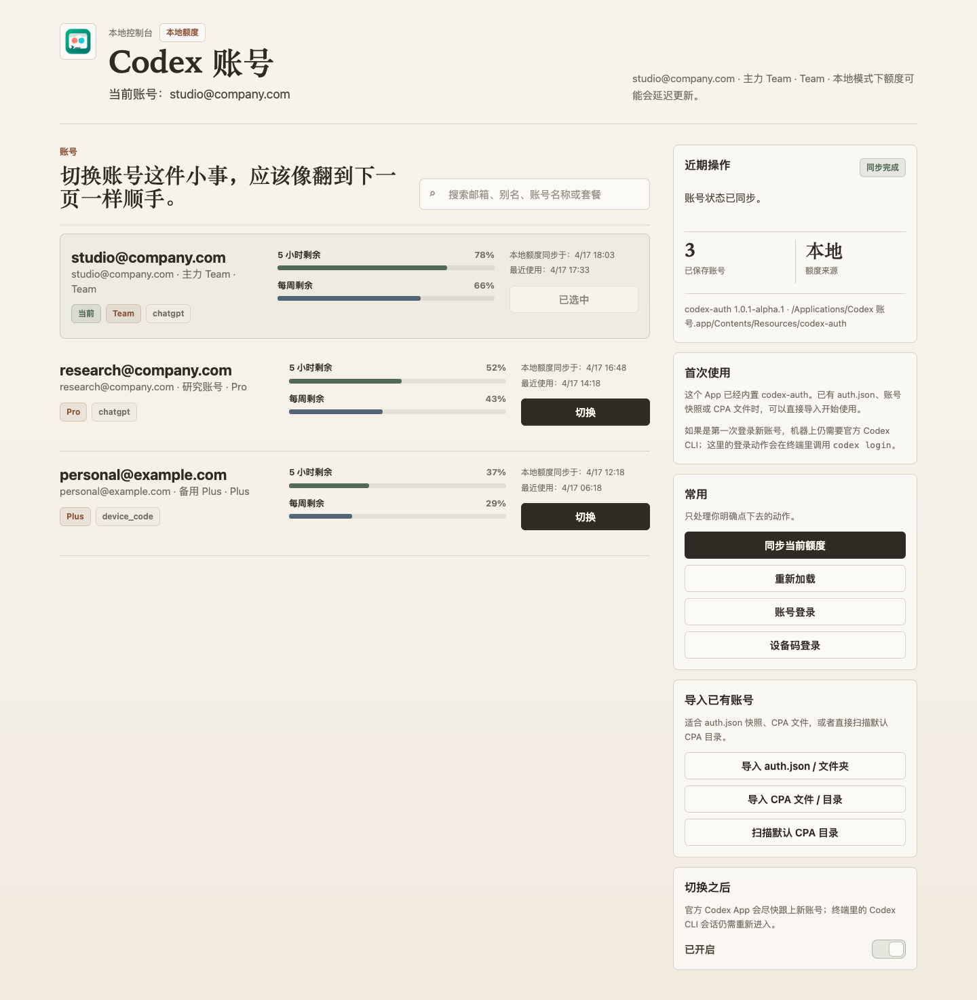
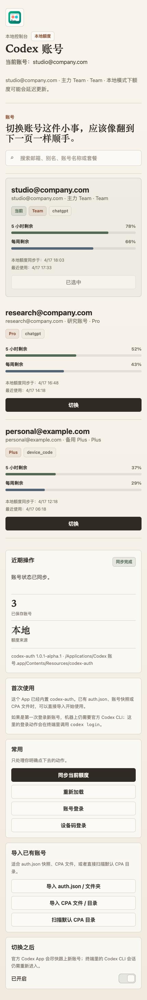

# Codex Auth

[简体中文](./README.md)

<p align="center">
  
</p>

`codex-auth` is a multi-account manager for Codex. The project now ships with two entry points:

- the `codex-auth` CLI for terminal and automation workflows
- the `Codex 账号` macOS menu bar app for quick switching, imports, and a local web control page

> [!IMPORTANT]
> For the official Codex CLI, VS Code extension, and Codex App, switching accounts usually still requires reopening the current CLI session before the new account is fully active.
> The menu bar app can automatically restart the official Codex App after a switch, but it does not take over already-open terminal sessions.

> [!NOTE]
> By project policy, CLI help text, prompts, errors, and JSON field names stay in English.
> The default README is Chinese, and this file provides the English version.

## Current UI

The current build defaults to a Chinese menu bar UI and a Chinese local web control page.



<p align="center">
  
</p>

Think of it as a combined workflow:

- use the menu bar for quick account switching, current-account refresh, and opening the web panel
- use the web control page for full management: search, switch, login, import, and preferences
- the local server listens only on `127.0.0.1`
- both the app and the web page rely on the `codex-auth` CLI JSON interface instead of writing Codex token files directly

## Good Fit For

- people who already have multiple Codex accounts and want faster manual switching
- people who do not want risky auto-switch-by-quota behavior
- people who want a lightweight Mac control surface instead of typing every switch in the terminal

## Download and Install

### Option 1: Download the macOS menu bar app

Download from [GitHub Releases](https://github.com/Daidai-star/codex-auth/releases):

- `CodexAuthMenu-macOS-ARM64.zip` for Apple Silicon
- `CodexAuthMenu-macOS-X64.zip` for Intel Macs

The menu bar app bundle already includes `codex-auth`, so:

- if you already have `auth.json`, account snapshots, or CPA files, the app can be used directly on its own
- if you want to add a brand-new account from scratch, the official Codex CLI is still required because login ultimately delegates to `codex login`

Install the official Codex CLI with:

```shell
npm install -g @openai/codex
```

### Option 2: Install the CLI

If you mostly work in the terminal, install the CLI package:

```shell
npm install -g @loongphy/codex-auth
```

Or run it without a global install:

```shell
npx @loongphy/codex-auth list
```

The npm packages currently support:

- Linux x64
- Linux arm64
- macOS x64
- macOS arm64
- Windows x64
- Windows arm64

## Feature Overview

- account list with active-account highlighting
- exact switching by `account_key`
- import from `auth.json`, CPA files, and the default CPA directory
- manual refresh for the current account's local usage snapshot
- optional restart of the official Codex App after a switch
- menu bar quick actions
- local web control page
- GitHub Releases that ship both CLI archives and macOS app bundles

## Common Commands

### Account Management

| Command | Description |
| --- | --- |
| `codex-auth list [--debug]` | List all accounts |
| `codex-auth login [--device-auth]` | Run `codex login`, then import the current account |
| `codex-auth switch [<email>]` | Switch interactively or by fuzzy match |
| `codex-auth remove` | Remove accounts interactively |
| `codex-auth status` | Show auto-switch, service, and usage status |

### Import

| Command | Description |
| --- | --- |
| `codex-auth import <path> [--alias <alias>]` | Import a file or batch import a directory |
| `codex-auth import --cpa [<path>]` | Import [CLIProxyAPI](https://github.com/router-for-me/CLIProxyAPI) token JSON |
| `codex-auth import --purge [<path>]` | Rebuild `registry.json` from existing auth files |

### Machine Interface

| Command | Description |
| --- | --- |
| `codex-auth list --json` | Emit account JSON without refreshing the usage API |
| `codex-auth list --json --refresh-usage` | Refresh usage manually, then emit JSON |
| `codex-auth switch --account-key <key> --json` | Switch by exact `account_key` and emit JSON |

### Configuration

| Command | Description |
| --- | --- |
| `codex-auth config auto enable\|disable` | Enable or disable experimental background auto-switching |
| `codex-auth config auto [--5h <%>] [--weekly <%>]` | Set experimental auto-switch thresholds |
| `codex-auth config api enable\|disable` | Enable or disable usage and team-name API refreshes |

## Seamless CLI Switching

If you use the official Codex CLI, the current terminal session still usually needs to be reopened after a switch.

If you want a more seamless CLI experience, use the enhanced [`codext`](https://github.com/Loongphy/codext):

```shell
npm i -g @loongphy/codext
codext
```

## Local Development

On some macOS setups with Zig `0.15.1`, the native build runner can fail early because it picks the host `macOS 26.x` target.

This repository includes compatibility wrappers. These are the recommended commands:

```shell
PATH="$PWD/scripts:$PATH" zig build run -- list
bash scripts/zig-build-compat.sh run -- list
bash scripts/validate-zig.sh
bash scripts/dev-cli.sh -- list
bash scripts/dev-cli.sh -- help
```

You can also use the npm shortcuts:

```shell
npm run validate:zig
npm run zig:build -- run -- list
npm run dev:cli -- list
```

### Build the Menu Bar App

```shell
bash apps/macos/CodexAuthMenu/Scripts/build-app.sh
open apps/macos/CodexAuthMenu/build/CodexAuthMenu.app
```

Package a release-ready zip with:

```shell
bash apps/macos/CodexAuthMenu/Scripts/package-release-app.sh
```

## Storage Root

`codex-auth` follows the same Codex state root as the current process. Resolution order:

1. `CODEX_HOME` when it points to a non-empty existing directory
2. `HOME/.codex`
3. `USERPROFILE/.codex` on Windows

To isolate auth, registry, config, or session state:

```shell
CODEX_HOME=/path/to/custom-codex codex-auth list
```

## Uninstall

If you installed through npm:

```shell
npm uninstall -g @loongphy/codex-auth
```

## More Docs

- [Release and CI](./docs/release.md)
- [API Refresh Notes](./docs/api-refresh.md)
- [Auto Switch Notes](./docs/auto-switch.md)
- [Schema Migration](./docs/schema-migration.md)
- [Testing Notes](./docs/test.md)
