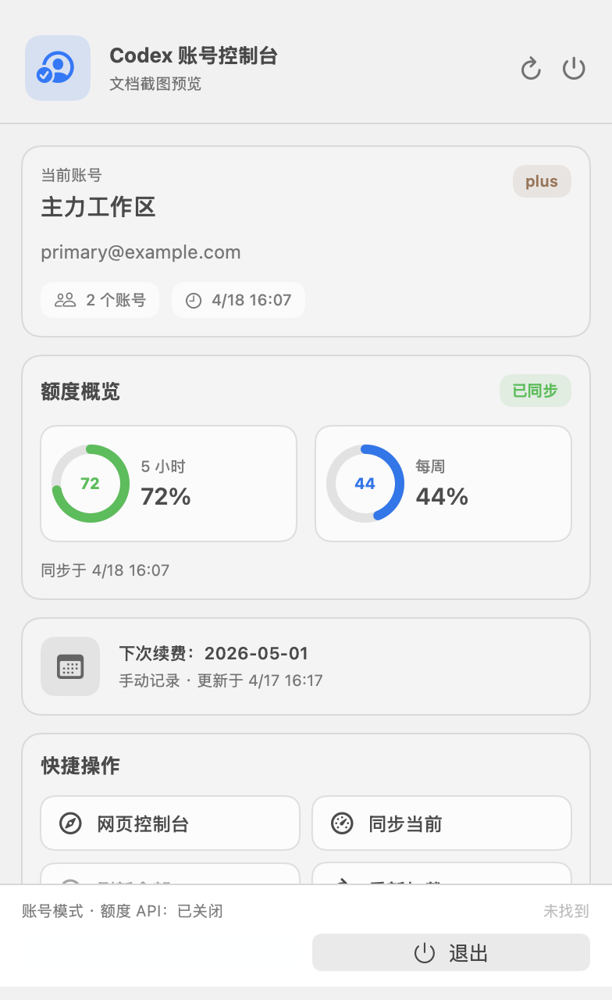

# Codex Auth

[English](./README.en.md)

<p align="center">
  
</p>

`codex-auth` 是一个面向 Codex 多账号管理的工具。现在这套项目同时提供两个入口：

- `codex-auth` CLI：适合终端、脚本和自动化流程
- `Codex 账号` macOS 菜单栏 App：适合日常手动切换、打开网页控制台、导入账号、同步历史和查看本地状态

> [!IMPORTANT]
> 对官方 Codex CLI、VS Code 扩展和 Codex App 来说，切换账号后，现有 CLI 会话通常仍需重新进入才能完全生效。
> 菜单栏 App 可以在切换后自动重启官方 Codex App，但不会直接接管你已经打开的终端会话。

> [!NOTE]
> 按项目规范，CLI 的 help、提示、错误信息和 JSON 字段保持英文。
> README 默认提供中文说明，同时保留一份英文版文档。

## 最新界面

当前版本默认提供中文菜单栏和中文网页控制台，下面是当前可直接展示的真实界面效果。




<p align="center">
  
</p>

你可以把它理解成一套“菜单栏快速入口 + 本地网页控制台”的组合：

- 菜单栏里快速查看当前状态、切换账号或 API 配置、同步当前账号本地额度、同步历史、打开网页控制台
- 网页控制台里做完整操作：搜索、切换、登录、导入、API 配置管理、历史同步、偏好设置
- 本地服务只监听 `127.0.0.1`
- 页面和菜单都尽量中文化
- App 和网页都不直接读写 Codex token 文件，统一走 `codex-auth` 的 CLI JSON 接口

## 适合什么场景

- 你已经有多个 Codex 账号，想更顺手地手动切换
- 你不想用“自动检测额度自动切号”这类风险更高的方案
- 你想保留自己的判断节奏，但又不想每次都手动回终端敲命令
- 你希望在 Mac 上通过菜单栏和浏览器面板管理 Codex 账号
- 你会在“账号登录”和“API 密钥登录”之间来回切换，并希望把本地历史尽量衔接起来

## 下载与安装

### 方式一：直接下载 macOS 菜单栏 App

从 [GitHub Releases](https://github.com/Daidai-star/codex-auth/releases) 下载：

- `CodexAuthMenu-macOS-ARM64.zip`：Apple Silicon
- `CodexAuthMenu-macOS-X64.zip`：Intel

另外，`main` 分支每次 CI 成功后，`Releases` 页面还会自动刷新一个滚动预发布：

- `main-snapshot`：最新一次成功构建的主分支安装包，适合想第一时间体验新版本时使用

菜单栏 App bundle 已经内置 `codex-auth`，所以：

- 如果你已经有 `auth.json`、账号快照或者 CPA 文件，直接下载 App 就能用
- 如果你要“从零新登录一个账号”，机器上仍然需要先安装官方 Codex CLI，因为登录动作最终还是会调用 `codex login`

官方 Codex CLI 安装：

```shell
npm install -g @openai/codex
```

### 方式二：安装 CLI

如果你主要在终端里工作，可以直接安装 CLI：

```shell
npm install -g @loongphy/codex-auth
```

也可以不全局安装，直接运行：

```shell
npx @loongphy/codex-auth list
```

npm 包当前历史版本覆盖：

- Linux x64
- Linux arm64
- macOS x64
- macOS arm64
- Windows x64
- Windows arm64

## 功能概览

- 账号列表和当前账号标记
- 按 `account_key` 精确切换
- 账号登录模式 / API 密钥模式切换
- 保存当前 API 配置、导入 cc switch 配置、按 profile 切换 API 配置
- 导入 `auth.json`、导入 CPA 文件、扫描默认 CPA 目录
- 手动刷新当前账号本地额度
- 手动同步本地历史会话
- 切换后可选自动重启官方 Codex App
- 菜单栏显示当前模式、当前账号摘要和快捷操作
- 本地网页控制台支持账号搜索、API 配置操作、历史同步和偏好设置
- 手动续费提醒记录
- GitHub Releases 提供 macOS CLI 压缩包和菜单栏 App 下载

## 常用命令

### 账号管理

| 命令 | 说明 |
| --- | --- |
| `codex-auth list [--debug]` | 列出所有账号 |
| `codex-auth login [--device-auth]` | 调用 `codex login`，然后导入当前账号 |
| `codex-auth switch [<email>]` | 交互式切换，或按模糊关键词匹配 |
| `codex-auth remove` | 交互式删除账号 |
| `codex-auth status` | 查看自动切换、服务和额度状态 |
| `codex-auth sync-history` | 将本地历史会话同步到当前 provider |

### API 配置

| 命令 | 说明 |
| --- | --- |
| `codex-auth api-profile capture --label <label> [--json]` | 保存当前 API 密钥配置为一个 profile |
| `codex-auth api-profile import-cc-switch --all [--json]` | 从 cc switch 批量导入 API 配置 |
| `codex-auth api-profile switch --profile-key <key> [--json]` | 切换到指定 API profile |

### 导入

| 命令 | 说明 |
| --- | --- |
| `codex-auth import <path> [--alias <alias>]` | 导入单个文件或批量导入目录 |
| `codex-auth import --cpa [<path>]` | 导入 [CLIProxyAPI](https://github.com/router-for-me/CLIProxyAPI) token JSON |
| `codex-auth import --purge [<path>]` | 根据现有 auth 文件重建 `registry.json` |

### 机器接口

| 命令 | 说明 |
| --- | --- |
| `codex-auth list --json` | 输出账号 JSON，不主动刷新 usage API |
| `codex-auth list --json --refresh-usage` | 手动刷新 usage 后输出 JSON |
| `codex-auth switch --account-key <key> --json` | 按精确 `account_key` 切换，并输出 JSON |
| `codex-auth api-profile capture --label <label> --json` | 输出保存后的最新状态 JSON |
| `codex-auth api-profile import-cc-switch --all --json` | 导入 cc switch 后输出最新状态 JSON |
| `codex-auth api-profile switch --profile-key <key> --json` | 切换 API profile 后输出最新状态 JSON |

### 配置

| 命令 | 说明 |
| --- | --- |
| `codex-auth config auto enable\|disable` | 开启或关闭实验性的后台自动切换 |
| `codex-auth config auto [--5h <%>] [--weekly <%>]` | 设置实验性的自动切换阈值 |
| `codex-auth config api enable\|disable` | 开启或关闭 usage / team name API 刷新 |

## 无缝切换说明

如果你用的是官方 Codex CLI，那么切换账号或者切换 API 配置之后，当前终端里的会话通常还是需要重新进入。

如果你想在 CLI 里获得更接近“无缝切换”的体验，可以使用增强版的 [`codext`](https://github.com/Loongphy/codext)：

```shell
npm i -g @loongphy/codext
codext
```

## 本地开发

在部分 macOS + Zig `0.15.1` 环境下，原生 build runner 可能因为宿主 `macOS 26.x` 目标而提前失败。

仓库内已经带了兼容包装脚本，推荐这样跑：

```shell
PATH="$PWD/scripts:$PATH" zig build run -- list
bash scripts/zig-build-compat.sh run -- list
bash scripts/validate-zig.sh
bash scripts/dev-cli.sh -- list
bash scripts/dev-cli.sh -- help
```

也可以使用 npm shortcuts：

```shell
npm run validate:zig
npm run zig:build -- run -- list
npm run dev:cli -- list
```

### 构建菜单栏 App

```shell
bash apps/macos/CodexAuthMenu/Scripts/build-app.sh
open apps/macos/CodexAuthMenu/build/CodexAuthMenu.app
```

打包 release 用的 zip：

```shell
bash apps/macos/CodexAuthMenu/Scripts/package-release-app.sh
```

## 存储目录

`codex-auth` 会跟随当前进程使用同一套 Codex 状态目录，解析顺序如下：

1. `CODEX_HOME`，前提是它指向一个非空且已存在的目录
2. `HOME/.codex`
3. Windows 下的 `USERPROFILE/.codex`

如果你想隔离 auth、registry、config 或 session，可以这样运行：

```shell
CODEX_HOME=/path/to/custom-codex codex-auth list
```

## 卸载

如果你是通过 npm 安装的，直接执行：

```shell
npm uninstall -g @loongphy/codex-auth
```

## 更多文档

- [Release and CI](./docs/release.md)
- [API Refresh Notes](./docs/api-refresh.md)
- [Auto Switch Notes](./docs/auto-switch.md)
- [Schema Migration](./docs/schema-migration.md)
- [Testing Notes](./docs/test.md)
